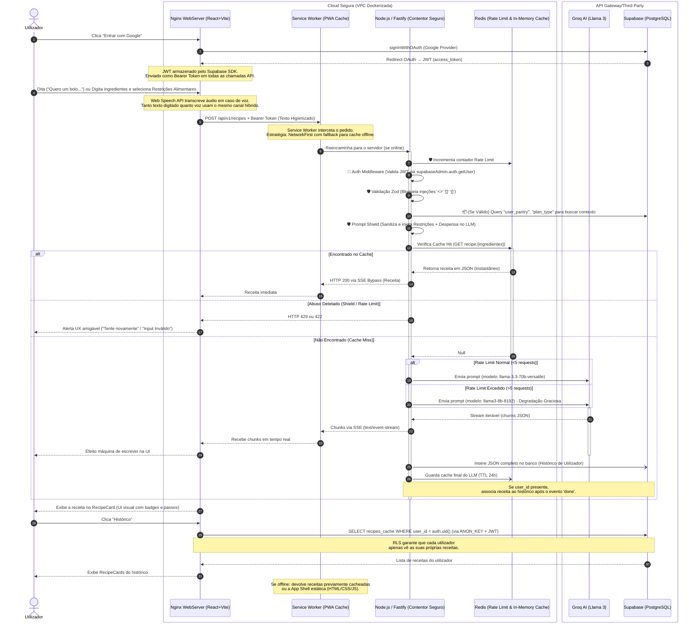

# Arquitetura do Sistema — FastCook

O FastCook emprega uma arquitetura moderna, com clara separação entre cliente e servidor para garantir segurança máxima (DevSecOps) e conformidade com privacidade desde a conceção.

## Diagrama de Sequência (Fluxo Principal)

O diagrama abaixo ilustra o ciclo de vida de um pedido de receita por voz, demonstrando como a arquitetura isola a Cloud de IA do cliente final e impede abusos.

## Porquê esta Arquitetura?

1. **Cliente 'Burro' (Zero Trust):** O frontend (React) nunca fala diretamente com o Groq (IA) nem tem permissões de escrita genéricas no Supabase. O Frontend apenas possui a `ANON_KEY` restrita por RLS.
2. **Backend Protetor (Shield):** O Fastify atua como middleware de segurança. Ele impõe limites de uso (Rate Limiting) e aplica o *Prompt Shield* para garantir que utilizadores não fazem "jailbreak" ao modelo de IA.
3. **Autenticação JWT (Zero Trust no Backend):** O Backend nunca confia no Frontend cegamente. O middleware `optionalAuth` valida o Bearer Token JWT via `supabaseAdmin.auth.getUser()` antes de associar receitas ao histórico de um utilizador. Sem token válido, o utilizador usa a app como anónimo (sem histórico). Consulte [`docs/auth_e_rbac.md`](./auth_e_rbac.md).
4. **Desempenho (Cache Inteligente):** A utilização do `recipes_cache` no Supabase economiza dramáticamente tokens da API do Groq mitigando custos, ao mesmo tempo que reduz a latência para os utilizadores finais em casos de receitas populares (ex: "Bolo de chocolate").
5. **LGPD/RGPD by Design:** O processamento da fala ocorre no browser ou não persiste o áudio, e nenhum dado sensível dos clientes interseta o contexto do LLM.
6. **PWA Offline (Service Worker):** O `vite-plugin-pwa` gera automaticamente um Service Worker (Workbox) que coloca em *precache* todos os ativos estáticos (App Shell) e aplica uma estratégia **NetworkFirst** para respostas da API. Isto permite que a aplicação seja **instalável** no telemóvel e continue funcional em modo offline, devolvendo receitas previamente consultadas a partir da cache local do browser. Consulte a documentação detalhada em [`docs/pwa_e_performance.md`](./pwa_e_performance.md).
