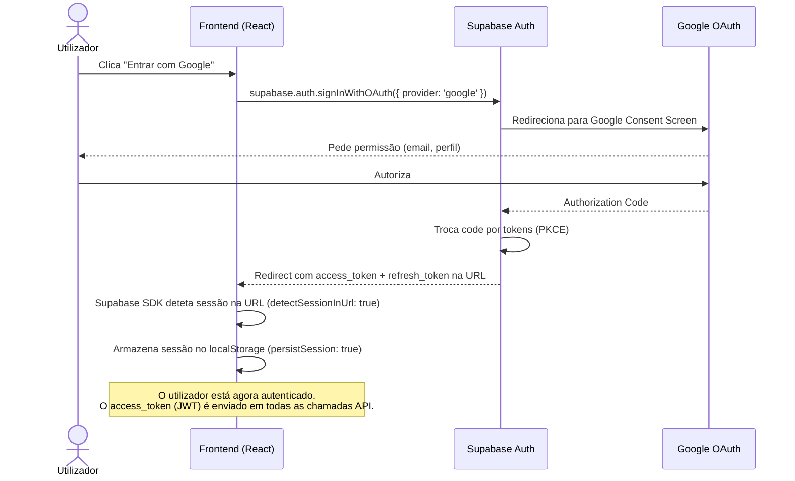

# Autenticação e Controlo de Acesso (RBAC) — FastCook

Este documento detalha o fluxo de autenticação com Google OAuth via Supabase, a validação de JWT no Backend (Fastify), e como o Row Level Security (RLS) protege o histórico de receitas de cada utilizador.

---

## 1. Fluxo de Login com Google (OAuth 2.0)

O FastCook utiliza o **Supabase Auth** como provedor de identidade, configurado com o **Google OAuth**.



### Pré-requisitos de Configuração

Para o Google OAuth funcionar, é necessário:

1. **Google Cloud Console:**
   - Criar um projeto e habilitar a **Google Identity API**.
   - Configurar o **OAuth Consent Screen** (tipo Externo).
   - Criar credenciais **OAuth 2.0 Client ID** (tipo Web Application).
   - Adicionar o URL de redirect do Supabase: `https://<project-ref>.supabase.co/auth/v1/callback`.

2. **Supabase Dashboard:**
   - Em **Authentication → Providers → Google**, ativar e colar o `Client ID` e `Client Secret` do Google.

---

## 2. Validação JWT no Backend (Fastify Middleware)

O Backend **nunca confia cegamente** no Frontend. Todas as requisições que pretendem guardar dados no histórico devem conter um Bearer Token JWT válido.

### Ficheiro: `backend/src/middlewares/auth.middleware.ts`

```
Authorization: Bearer <supabase_access_token>
```

**Fluxo do Middleware (`optionalAuth`):**

| Cenário | Ação | Resultado |
|---|---|---|
| Sem header `Authorization` | Continua sem `userId` | Utilizador anónimo — receita gerada mas **não** guardada no histórico |
| Token inválido / expirado | Log de aviso, continua sem `userId` | Tratado como anónimo (degradação graciosa) |
| Token válido | `supabaseAdmin.auth.getUser(token)` retorna o utilizador | `request.userId` é preenchido com o UUID do Supabase |

### Porquê `supabaseAdmin.auth.getUser(token)` e não verificação local do JWT?

- **Simplicidade:** Não requer biblioteca adicional (`jsonwebtoken`) nem gestão do JWT Secret.
- **Segurança:** O Supabase verifica no servidor se o token não foi revogado (ex: utilizador fez logout noutro dispositivo).
- **Trade-off:** Uma chamada de rede extra (~10-20ms). Para o nosso caso de uso (1 request por interação de voz), é negligível.

---

## 3. Row Level Security (RLS) — Proteção do Histórico

A tabela `recipes_cache` possui a coluna `user_id` (nullable) que associa receitas a utilizadores autenticados.

### Políticas RLS Ativas

| Política | Operação | Alvo | Condição |
|---|---|---|---|
| `recipes_cache: select own history` | `SELECT` | `authenticated` | `user_id = auth.uid()` |
| `recipes_cache: insert service_role only` | `INSERT` | `service_role` | Sempre permitido |
| `recipes_cache: delete service_role only` | `DELETE` | `service_role` | Sempre permitido |

**Implicações de segurança:**

- **Frontend:** Quando o utilizador consulta o histórico, o SDK do Supabase envia o JWT com a ANON_KEY. O RLS garante que apenas receitas com `user_id = auth.uid()` são retornadas. Um utilizador **nunca** vê receitas de outro.
- **Backend:** Utiliza a `SERVICE_ROLE_KEY` que contorna RLS, permitindo escrever receitas com qualquer `user_id`. Isto é seguro porque o `user_id` foi previamente validado pelo middleware JWT.
- **Anónimos:** Receitas sem `user_id` (null) não aparecem no histórico de ninguém. Podem futuramente ser usadas apenas para cache global.

---

## 4. Partilha Segura via WhatsApp

O botão "Partilhar" no `RecipeCard` formata a receita como texto puro e abre a API do WhatsApp:

```
https://wa.me/?text=<TEXTO_CODIFICADO>
```

**Princípios de Segurança na Partilha:**

- **Zero IDs expostos:** Nenhum UUID de base de dados, `query_hash`, ou token é incluído no texto partilhado.
- **Apenas conteúdo:** Nome da receita, tempo, dificuldade e passos — informação pública e não sensível.
- **`encodeURIComponent`:** Previne injeção de parâmetros na URL.
- **`noopener,noreferrer`:** O `window.open` não permite à página de destino aceder ao `window.opener` do FastCook.

---

## 5. Migração de Base de Dados

A migração `002_user_history.sql` aplica as seguintes alterações:

```sql
-- Adiciona coluna user_id (nullable) com FK para auth.users
ALTER TABLE public.recipes_cache
  ADD COLUMN user_id UUID REFERENCES auth.users(id) ON DELETE CASCADE;

-- Remove UNIQUE em query_hash (múltiplos utilizadores podem gerar a mesma receita)
ALTER TABLE public.recipes_cache
  DROP CONSTRAINT recipes_cache_query_hash_key;

-- Nova política RLS: cada utilizador vê apenas o seu próprio histórico
CREATE POLICY "recipes_cache: select own history"
  ON public.recipes_cache FOR SELECT TO authenticated
  USING (user_id = auth.uid());
```

> **Importante:** Execute esta migração no SQL Editor do Supabase após as tabelas iniciais (`001_initial_schema.sql`).
