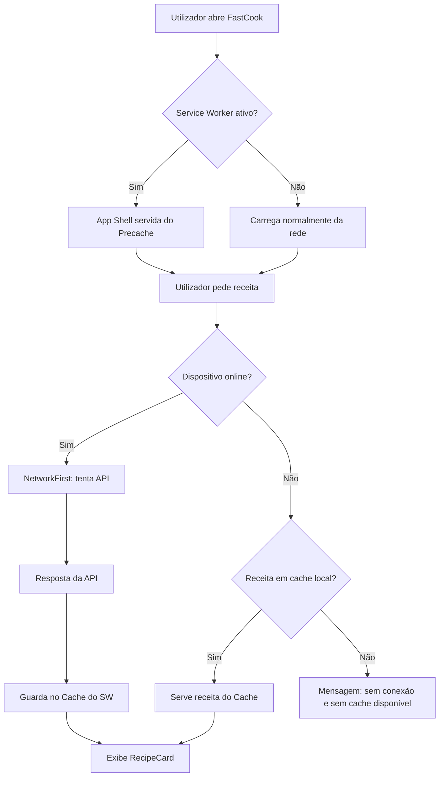

# PWA e Performance — FastCook

O FastCook é uma **Progressive Web App (PWA)** completa, permitindo instalação no dispositivo e acesso offline a receitas previamente consultadas.

---

## 1. Configuração do Service Worker

A PWA é configurada através do [`vite-plugin-pwa`](https://vite-pwa-org.netlify.app/) no ficheiro `frontend/vite.config.ts`. O plugin gera automaticamente um Service Worker baseado no [Workbox](https://developer.chrome.com/docs/workbox/) durante o `vite build`.

### Estratégias de Cache

| Tipo de Recurso | Estratégia | TTL | Descrição |
|---|---|---|---|
| **App Shell** (HTML, CSS, JS, fontes, ícones) | **Precache** | Indefinido (atualizado com novo deploy) | Todos os ativos estáticos são cacheados na instalação do SW. A app abre instantaneamente mesmo offline. |
| **API de Receitas** (`/api/*`) | **NetworkFirst** | 7 dias, máx. 30 entradas | Tenta a rede primeiro; se offline, devolve a última resposta cacheada para aquela receita. |
| **Supabase** (`*.supabase.co`) | **NetworkFirst** | 24 horas, máx. 50 entradas | Dados do Supabase são servidos pela rede quando disponível, com fallback para cache. |

### Modo de Registo

O Service Worker utiliza `registerType: 'autoUpdate'`, o que significa que novas versões da aplicação são ativadas automaticamente em segundo plano sem intervenção do utilizador.

---

## 2. Manifest (Web App Manifest)

O `manifest.webmanifest` é gerado automaticamente pelo plugin com as seguintes propriedades:

```json
{
  "name": "FastCook — Receitas por Voz com IA",
  "short_name": "FastCook",
  "theme_color": "#ffffff",
  "background_color": "#f9fafb",
  "display": "standalone",
  "scope": "/",
  "start_url": "/"
}
```

O modo `standalone` remove a barra de endereço do browser, proporcionando uma experiência nativa no telemóvel.

---

## 3. Como Testar a PWA Localmente

### 3.1. Build de Produção

A PWA **não funciona** em modo `dev` (Vite dev server). É necessário criar o build de produção e servir com `preview`:

```bash
cd frontend
npm run build
npm run preview
```

Aceda a `http://localhost:4173` no browser.

### 3.2. Verificar no Chrome DevTools

1. Abra **DevTools** → separador **Application**.
2. No menu lateral, clique em **Service Workers**:
   - Verifique que o `sw.js` está "activated and running".
3. Clique em **Manifest**:
   - Verifique o nome, ícones e `display: standalone`.
4. Clique em **Cache Storage**:
   - Deverá ver entradas de `precache` (App Shell) e `api-recipes-cache` (receitas).

### 3.3. Testar Modo Offline

1. No separador **Application** → **Service Workers**, marque a checkbox **"Offline"**.
2. Recarregue a página — a App Shell deverá continuar a carregar normalmente.
3. Se já tiver consultado receitas anteriormente, estas serão servidas a partir da cache.

### 3.4. Instalar no Dispositivo

- **Desktop (Chrome/Edge):** Clique no ícone de instalação na barra de endereço (⊕) ou no menu `...` → "Instalar FastCook".
- **Mobile (Android/Chrome):** Aparecerá automaticamente um banner "Adicionar ao Ecrã Inicial" após dois acessos. Alternativamente, use o menu do browser → "Adicionar ao Ecrã Inicial".
- **iOS (Safari):** Toque em "Partilhar" (⬆) → "Adicionar ao Ecrã Inicial".

---

## 4. Ícones PWA

Para uma experiência completa, coloque os seguintes ficheiros na pasta `frontend/public/`:

| Ficheiro | Tamanho | Uso |
|---|---|---|
| `pwa-192x192.png` | 192×192px | Ícone padrão Android / Chrome |
| `pwa-512x512.png` | 512×512px | Splash screen / ícone de alta resolução |
| `favicon.svg` | Vetorial | Ícone do browser (tab) |

> **Nota:** Pode gerar os ícones automaticamente a partir de um SVG usando ferramentas como [RealFaviconGenerator](https://realfavicongenerator.net/) ou [PWA Asset Generator](https://github.com/nicedoc/pwa-asset-generator).

---

## 5. Diagrama de Cache (Mermaid)


